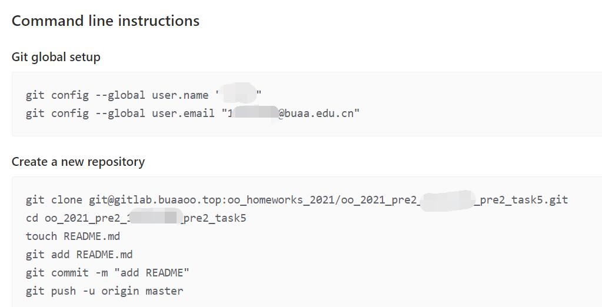

# GitLab配合vscode

因为我电脑上已经有了Github账号，而且邮箱、用户名和课程组给的不同，所以得多配置一个本地的git账户。我看了很多资料，最终可行的是[这一篇](https://blog.csdn.net/a3212/article/details/80104045)。

简单来说，就是生成两对公私钥，分别粘贴到GitHub和GitLab上，再新建本地的config文件，最后测试连接，完成了这些，就可以用命令行来推送了。

不过在我本人使用的过程中，还有一个问题，就是第一次向GitLab推送，必须是以命令行的方式而不能用vscode自带的git，以下图为例，只有老老实实命令行跑一遍，vscode才能推送。

最可气的是，我把测评中20次无代价提交，理解成了commit！导致迟迟没敢尝试。
