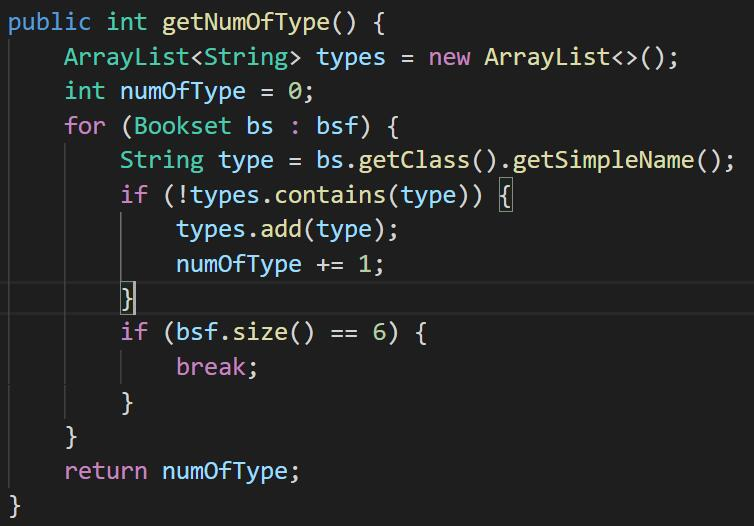
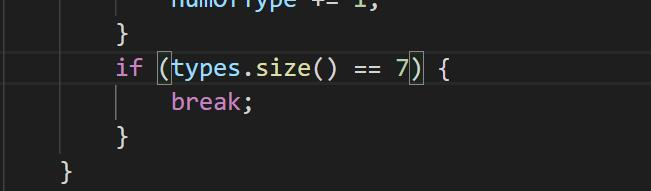

# Pre2

记录资料以及自己犯过的错。

## 参考资料

[CSDN: 多态](https://blog.csdn.net/yigan123/article/details/106504556)

[CSDN: 简单工厂](https://blog.csdn.net/u013132035/article/details/80633755)

### 自己的想法

对于这次课程，`ArrayList<SuperClass>`里面可以存`SubClass`，我感觉这是唯一的用处（我是不是没救了...)。

## Task3

1. 输出书本信息时，有两个属性之间没有用空格隔开
2. 简单工厂新建OtherS时，year未接受
3. 查询书架上丛书的种类个数，我的做法是遍历bookshelf，将bookset的类名添加到一个`ArrayList<String>`里，直到ArrayList的size为题设允许的最多丛书种类，结果在此处笔误了，打错成书架大小为丛书种类了。
   
4. 以为题设允许的最多丛书种类就6种，其实是7种。
   

## Task4

坑就是，从书架上remove了一本丛书，后还要输出剩余丛书的数量，这个输出丛书的数量就不能再调用前面那个查询书架上丛书数量的函数了，因为可能会抛出异常。我的方法是直接再写一个不抛异常的查询丛书数量的方法。

还用就是是写Exception类的顺序

1. 写自定义Exception类
2. 写抛出这些Exception的方法
3. 写try...catch...

这样比较规整，不至于手忙脚乱

## Task5

1. clone的使用，如果不会，此题无解
2. 俺还放的一个错误是flag设置后未更新错误，这个就和Java没啥关系，和编程思维有关
